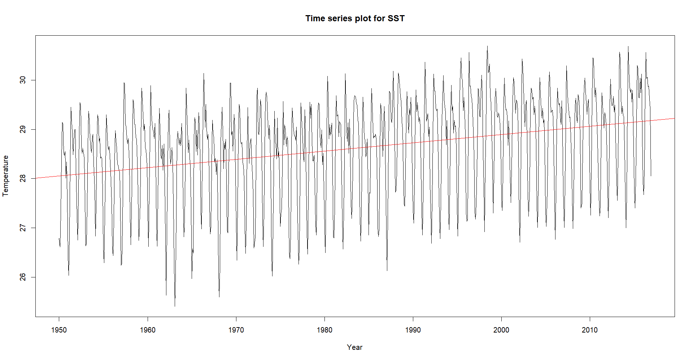
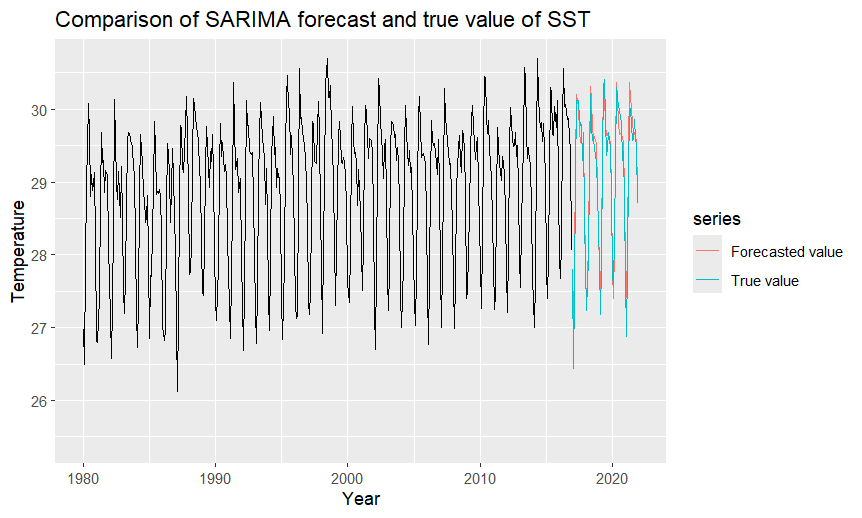
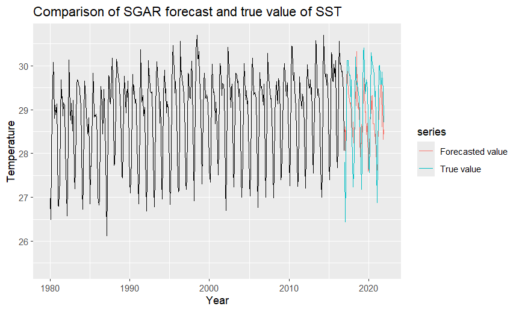
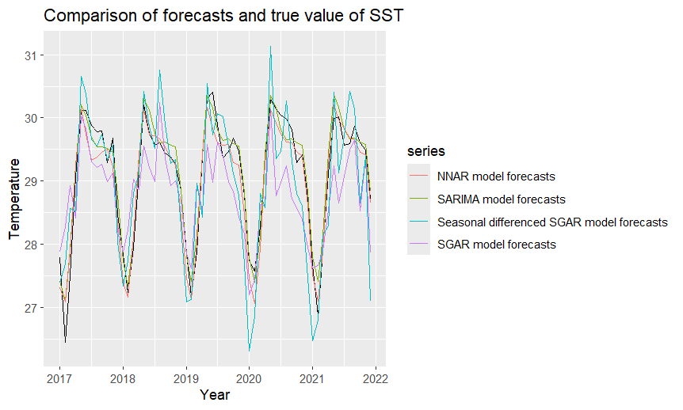

# AnalysisSST
Analysis of sea surface temperature (SST) using time series models. Focusing on SST data from Year 1950 to Year 2022.

## Study objective
- Investigate the performance of the SGAR model on the analysis of SST behaviour in Labuan waters.
- Apply seasonal autoregressive integrated moving average (SARIMA) model on SST in Labuan waters.
- Apply neural network autoregressive (NNAR) model on SST in Labuan waters.
- Compare the forecast results provided by the models.

### Plots
- Increasing trend in SST
    
- Comparison with actual values
    | Model  | Plot |
    |--------|------|
    | SARIMA ||
    | NNAR   || 
    | SGAR   ||
- Comparison of all results
    

## Acknowledgement
1. Dataset: Hadley Centre Sea Ice and Sea Surface Temperature data set ([HadISST](https://www.metoffice.gov.uk/hadobs/hadisst/)), in NetCDF format.
